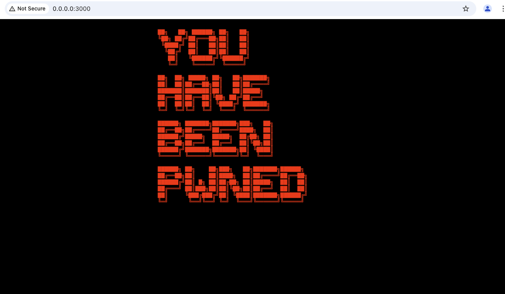
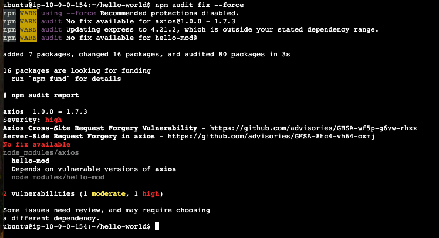

## You have been PWNED

Check out the web application you got up and running in the last lab. A hacker was able to find a weakness in the code running on your virtual server.



Hackers have goals like all of us.  Once they have found a breach they get to work on those goals. They want to create another way to access you virtual server in case you fix the current exploit. They will want to find other virtual servers or resources within your environment.  Ultimately they will want to try and gain access to your cloud account itself.

## Lab Overview

In this lab you will revisit some of the decisions made while rushing to get your web application up and running.  The decisions made were to remove friction and reach your goal of running your web application as quickly as possible. Keep in mind that these decisions are the exact same decisions that cloud practitioners are faced with everyday.  Keeping a cloud environment secure is a constant effort and has many dimensions.

## Code: Install all the things

The first thing you did on your new virtual server was to install new software and code.  You started with copying some code from Github.  Followed by adding the NodeJS runtime and NodeJS package manager (NPM).  Then using the NPM package manager you installed even more code, some of that code installed even more code. 

You did get a warning from NPM about vulnerabilities with some of the code you installed.  To try and reduce your risk go back to the AWS Instant Connect console where you started you web application.  Use `control x` to exit the application and run the following command that npm suggest.

```bash
npm audit fix --force
```



While this didn't resolve all of the security issues, it did reduce your risk from 4 highs to 1 high (and one moderate) vulnerablity.

Take away is all your code is built on other code. All code comes with risks.

## Configuration: Open all the ports

The web application you setup only needed port 3000 open to receive inbound requests.  Instead of taking the time to figure out what port was needed you opened up all the ports from 1000 and 6000.  This was done to save time and avoid issues. The downside of this decision is your virtual server is now listening for inbound traffic all of those ports  

The hacker first step will be to a new service that would allow them to access your virtual server.  If only port 22 and 3000 were open they would have to stop one of those services to use those ports.  This is something you would probably notice.  Having so many ports open allows the hacker to simply start up a service listing on port 5000, for example.

Run the command below in the Instance Connect console where you ran commands before. The `nc` command is a unix utility called `netcat`. Passing the `-l` flag to netcat makes it listen for connection over TCP or UDP on a given port.

```bash
nc -l 5000
```
In your browser return to your web application page and replace the `3000` with `5000` and reload the page.  Got back to the AWS Instant Connect console where you will find you were able to connect with netcat.  Note you can see what browser used, the OS and the IP address of where the request came from.


Take away is opening too many ports is not a great idea.  Be careful what you expose to the Internet!

## Identity: Grants all the permissions

Recall that you needed to allows your web application to access a shared database.  To allow this access you granted the admin role directly to your virtual server.  In AWS users and resources can have roles attached that allow them to access and manage cloud resources.  Let's explore a few of the issue with granting so many privileges.  

The main goal of a hacker is to gain greater access either to other virtual server or better yet your cloud account. Getting existing user credentials would be a great. If these credentials could be used to create a new user, even better.

AWS runs an internal service call the `metadata service`. The `metadata service` is designed to allow for discovery details about virtual servers.  These details include role and permission assigned to the server.

The commands below will create a token that we will use to query for information from the metadata service. Then next command will return the name of the role assigned to your virtual server.

```bash
TOKEN=`curl -X PUT "http://169.254.169.254/latest/api/token" -H "X-aws-ec2-metadata-token-ttl-seconds: 21600"`
curl -v -H "X-aws-ec2-metadata-token: $TOKEN" http://169.254.169.254/latest/meta-data/iam/security-credentials/; echo ""
```


Replace the role name returned from the previous command for <ROLE_NAME> in the command below.  The output of the command below will include a set of AWS security credentials (AccessKeyId, SercretKey and Token). 

```bash
curl -v -H "X-aws-ec2-metadata-token: $TOKEN" http://169.254.169.254/latest/meta-data/iam/security-credentials/<ROLE_NAME>
```

These credentials can be used by an attacker to perform any actions the role can.  As you might recall we gave this role admin privileges.  The goal of moving from your virtual server to the your cloud account is achieved.

Take away grant the least permissions you can to a resource of user.

## Cloud Security is tough

The cloud has changed how teams work.  The cloud has enabled engineering teams to move quickly, scale massively services and outpace other teams like operations and security. Hopefully you have seen how seemingly small decisions can have big impacts on the security posture of your cloud environment. This is where products like FortiCNAPP can help, they give teams visibility into their cloud security posture.